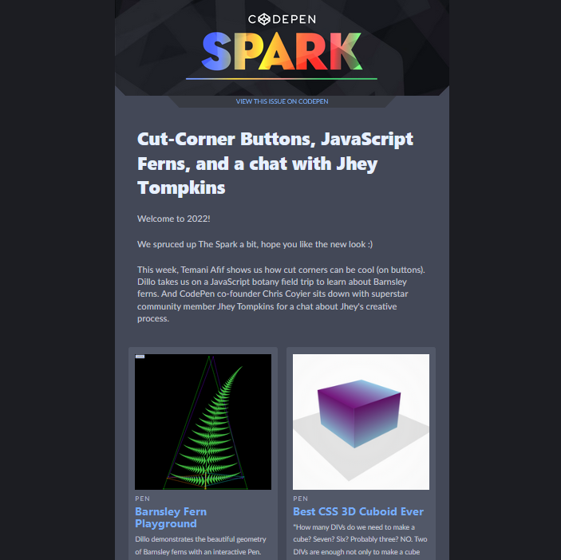

# CodePen Jan 2022 Newsletter Remake

A rebuild of an CodePen Email Newsletter using the Maizzle framework, powered with TailwindCSS.

# Overview

This is the third HTML email project I've built, with the previous two consisting of Vanilla HTML/CSS markup and the MJML framework. This is an exploration in the use of Maizzle to get to know another approach in creating responsive compatible emails. The production build has been tested with Gmail, Gmail for Android, Outlook for Windows, and Outlook.com.

## _Copyright Notice_

_I do not own any of the images shown in this project, and have been used to solely replicate the original newsletter in its entirety. I have no intention of selling or licensing any of the images or the content of this project._
